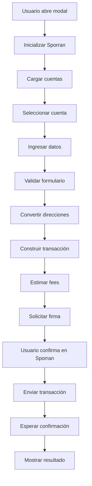
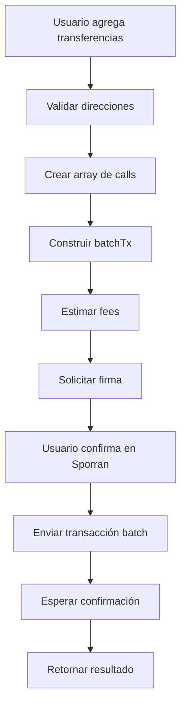

# Transferencias KILT con Sporran - Documentación Completa

## 📋 Índice

1. [Introducción](#introducción)
2. [Arquitectura](#arquitectura)
3. [Componentes](#componentes)
4. [Servicios](#servicios)
5. [Flujo de Transferencia](#flujo-de-transferencia)
6. [Configuración](#configuración)
7. [Casos de Uso](#casos-de-uso)
8. [Troubleshooting](#troubleshooting)

## 🚀 Introducción

El sistema de transferencias KILT permite enviar tokens KILT y PILT entre direcciones SS58 usando la extensión Sporran. Soporta tanto la red principal (Spiritnet) como la red de pruebas (Peregrine).

### Características Principales

- ✅ **Transferencias Directas**: Envío de KILT/PILT entre direcciones
- ✅ **Integración Sporran**: Firma segura con la extensión oficial
- ✅ **Múltiples Redes**: Spiritnet (KILT) y Peregrine (PILT)
- ✅ **Conversión de Direcciones**: Manejo automático de formatos KILT/Substrate
- ✅ **Estimación de Fees**: Cálculo automático de costos de transacción
- ✅ **Validaciones**: Verificación completa de entradas

## 🏗️ Arquitectura

### Estructura de Archivos

```
src/
├── components/
│   └── KiltTransferModal.tsx    # Modal de transferencias
├── lib/
│   ├── kilt-transfer.ts         # Servicio de transferencias
│   ├── sporran.ts              # Integración con Sporran
│   └── kilt-balance.ts         # Gestión de balances
├── types/
│   └── sporran.ts              # Tipos TypeScript
└── app/
    └── swapping/
        └── page.tsx            # Página principal
```

### Flujo de Datos



## 🧩 Componentes

### KiltTransferModal

Componente principal para realizar transferencias KILT.

```tsx
<KiltTransferModal
  isOpen={showModal}
  onClose={() => setShowModal(false)}
  onTransferComplete={(result) => {
    console.log('Transferencia completada:', result)
  }}
/>
```

**Props:**
- `isOpen`: Controla la visibilidad del modal
- `onClose`: Función para cerrar el modal
- `onTransferComplete`: Callback cuando se completa la transferencia

**Funcionalidades:**
- ✅ Selección de cuenta remitente
- ✅ Selección de red (Spiritnet/Peregrine)
- ✅ Validación de direcciones
- ✅ Estimación de fees
- ✅ Firma con Sporran
- ✅ Manejo de errores

## 🔧 Servicios

### KiltTransferService

Servicio principal para manejar transferencias KILT.

```typescript
import { kiltTransferService } from '@/lib/kilt-transfer'

// Realizar transferencia
const result = await kiltTransferService.transfer({
  from: '4oWFs5d1sLtHhQRtdP7JormY1wfWNnnpHUD7Gkpuj36mu9R8',
  to: '4oTutceLovChf5vgWzZqAvkNVGG7SjprfZNRv5mV1iVYvpAh',
  amount: '1.5',
  network: 'peregrine'
})
```

**Métodos Principales:**

#### transfer(request: KiltTransferRequest)
Realiza una transferencia de tokens KILT.

**Parámetros:**
- `from`: Dirección del remitente
- `to`: Dirección del destinatario
- `amount`: Cantidad a transferir
- `network`: Red de destino ('spiritnet' | 'peregrine')
- `message`: Mensaje opcional

**Retorna:**
```typescript
{
  success: boolean
  hash?: string
  error?: string
  fees?: {
    femtoKilt: string
    kilt: string
    ticker: string
  }
}
```

#### getBalance(address: string, network: string)
Obtiene el balance de una cuenta.

#### validateAddress(address: string)
Valida el formato de una dirección KILT.

#### formatAddress(address: string)
Formatea una dirección para mostrar.

### Configuración de Redes

```typescript
const NETWORK_CONFIG = {
  spiritnet: {
    endpoint: 'wss://spiritnet.kilt.io',
    genesisHash: '0x411f057b9107718c9624d6aa4a3f23c1653898297f3d4d529d9bb6511a39dd21',
    ticker: 'KILT'
  },
  peregrine: {
    endpoint: 'wss://peregrine.kilt.io/parachain-public-ws',
    genesisHash: '0xa0c6e3bac382b316a68bca7141af1fba507207594c761076847ce358aeedcc21',
    ticker: 'PILT'
  }
}
```

## 🔄 Flujo de Transferencia

### 1. Inicialización

```typescript
// Inicializar Sporran
initializeSporranHandshake()

// Cargar cuentas disponibles
const accounts = await getSporranAccounts()
```

### 2. Validación

```typescript
// Validar campos requeridos
if (!from || !to || !amount) {
  throw new Error('Campos requeridos faltantes')
}

// Validar formato de dirección
if (!validateAddress(to)) {
  throw new Error('Formato de dirección inválido')
}

// Validar cantidad
if (parseFloat(amount) <= 0) {
  throw new Error('Cantidad debe ser mayor a 0')
}
```

### 3. Conversión de Direcciones

```typescript
// Convertir direcciones para Sporran
const fromSubstrate = await kiltToSubstrateAddress(from)
const toSubstrate = await kiltToSubstrateAddress(to)
```

### 4. Construcción de Transacción

```typescript
// Conectar a la red
await kiltTransferService.connect(network)

// Construir transacción
const transferTx = api.tx.balances.transferKeepAlive(
  to, // Usar dirección KILT original
  amountInFemtoKilt
)
```

### 5. Estimación de Fees

```typescript
// Estimar fees
const { partialFee } = await transferTx.paymentInfo(from)
const feesInKilt = (parseInt(partialFee.toString()) / Math.pow(10, 15)).toFixed(15)
```

### 6. Firma y Envío

```typescript
// Habilitar extensiones
const extensions = await web3Enable('Sporran dApp')

// Obtener cuenta
const accounts = await web3Accounts()
const senderAccount = accounts.find(acc => acc.address === fromSubstrate)

// Firmar transacción
const signerExtension = await web3FromAddress(fromSubstrate)
const { signer } = signerExtension

// Enviar transacción
transferTx.signAndSend(from, { signer }, (result) => {
  if (result.status.isInBlock) {
    console.log('Transacción completada:', result.status.asInBlock.toHex())
  }
})
```

## ⚙️ Configuración

### Variables de Entorno

```env
# Endpoints de redes KILT (opcionales, usa valores por defecto)
NEXT_PUBLIC_SPIRITNET_ENDPOINT=wss://spiritnet.kilt.io
NEXT_PUBLIC_PEREGRINE_ENDPOINT=wss://peregrine.kilt.io/parachain-public-ws
```

### Configuración de Sporran

1. **Instalar extensión**: [Sporran Chrome Extension](https://chrome.google.com/webstore/detail/sporran/djdnajgjcbjhhbdblkegbcgodlkkfhcl)
2. **Crear cuentas**: Importar o crear nuevas cuentas en Sporran
3. **Habilitar redes**: Asegurar que las cuentas estén habilitadas para Spiritnet/Peregrine

## 💼 Casos de Uso

### 1. Transferencia Básica

```typescript
// Transferir 1.5 KILT en Spiritnet
const result = await kiltTransferService.transfer({
  from: '4oWFs5d1sLtHhQRtdP7JormY1wfWNnnpHUD7Gkpuj36mu9R8',
  to: '4oTutceLovChf5vgWzZqAvkNVGG7SjprfZNRv5mV1iVYvpAh',
  amount: '1.5',
  network: 'spiritnet'
})
```

### 2. Transferencia en Testnet

```typescript
// Transferir 10 PILT en Peregrine
const result = await kiltTransferService.transfer({
  from: '4oWFs5d1sLtHhQRtdP7JormY1wfWNnnpHUD7Gkpuj36mu9R8',
  to: '4oTutceLovChf5vgWzZqAvkNVGG7SjprfZNRv5mV1iVYvpAh',
  amount: '10',
  network: 'peregrine'
})
```

### 3. Obtener Balance

```typescript
// Obtener balance en Spiritnet
const balance = await kiltTransferService.getBalance(
  '4oWFs5d1sLtHhQRtdP7JormY1wfWNnnpHUD7Gkpuj36mu9R8',
  'spiritnet'
)

console.log(balance.formatted) // "1.500000000000000 KILT"
```

### 4. Validar Dirección

```typescript
// Validar formato de dirección
const isValid = kiltTransferService.validateAddress(
  '4oWFs5d1sLtHhQRtdP7JormY1wfWNnnpHUD7Gkpuj36mu9R8'
)

console.log(isValid) // true
```

## 🔧 Troubleshooting

### Problemas Comunes

#### 1. "Sporran no detectado"

**Causa**: La extensión Sporran no está instalada o habilitada.

**Solución**:
- Verificar que Sporran esté instalado
- Asegurar que esté habilitado en el navegador
- Recargar la página

#### 2. "Cuenta no encontrada"

**Causa**: La cuenta no está disponible en Sporran.

**Solución**:
- Verificar que la cuenta esté creada en Sporran
- Asegurar que esté habilitada para la red correspondiente
- Verificar la conversión de direcciones

#### 3. "Error de conexión"

**Causa**: Problemas de conectividad con los endpoints de KILT.

**Solución**:
- Verificar conexión a internet
- Intentar cambiar de red
- Verificar si los endpoints están disponibles

#### 4. "Saldo insuficiente"

**Causa**: La cuenta no tiene suficientes tokens.

**Solución**:
- Verificar el balance disponible
- Considerar los fees de transacción
- Reducir la cantidad a transferir

### Logs de Debug

```typescript
// Habilitar logs detallados
console.log('🔄 Convirtiendo dirección:', address)
console.log('💰 Fees estimados:', fees)
console.log('✅ Transacción completada:', hash)
```

### Herramientas de Debug

1. **Consola del navegador**: Todos los logs están disponibles
2. **Network tab**: Verificar conexiones WebSocket
3. **Extension tab**: Verificar estado de Sporran
4. **Block explorer**: Verificar transacciones en la blockchain

## 📚 Referencias

- [KILT Protocol Documentation](https://docs.kilt.io/)
- [Sporran Extension](https://www.sporran.org/)
- [Polkadot.js Extension API](https://github.com/polkadot-js/extension)
- [Substrate SS58 Address Format](https://docs.substrate.io/reference/address-formats/)

## 📦 Batch Transfers (Transferencias por Lotes)

### Introducción

El sistema de **Batch Transfers** permite enviar múltiples transferencias a diferentes destinatarios en una sola transacción blockchain, optimizando fees y mejorando la experiencia del usuario.

### Características

- ✅ **Múltiples Destinatarios**: Hasta 50 transferencias por lote
- ✅ **Una Sola Firma**: Confirmación única en Sporran
- ✅ **Fees Optimizados**: Menor costo que transferencias individuales
- ✅ **Validación Completa**: Verificación de todas las direcciones
- ✅ **Resumen Automático**: Total de transferencias y montos

### Arquitectura

```typescript
// Interfaces para Batch Transfers
interface BatchTransferRequest {
  from: string
  transfers: Array<{
    to: string
    amount: string
    message?: string
  }>
  network: 'spiritnet' | 'peregrine'
}

interface BatchTransferResult {
  success: boolean
  hash?: string
  error?: string
  fees?: {
    femtoKilt: string
    kilt: string
    ticker: string
  }
  transfers: Array<{
    to: string
    amount: string
    success: boolean
    error?: string
  }>
}
```

### Componente BatchTransferModal

```tsx
<BatchTransferModal
  isOpen={showBatchModal}
  onClose={() => setShowBatchModal(false)}
  onTransferComplete={(result) => {
    if (result.success) {
      console.log('Batch completado:', result.hash)
    }
  }}
/>
```

### Servicio batchTransfer()

```typescript
import { kiltTransferService } from '@/lib/kilt-transfer'

// Ejemplo de uso
const batchRequest = {
  from: '4nvX9voWACheipv3VsgRuK2QZeDVhBAD68syKocrMd7a8Fjb',
  network: 'peregrine',
  transfers: [
    { to: '4oTutceLovChf5vgWzZqAvkNVGG7SjprfZNRv5mV1iVYvpAh', amount: '1' },
    { to: '5GrwvaEF5zXb26Fz9rcQpDWS57CtERHpNehXCPcNoHGKutQY', amount: '2' },
    { to: '5FHneW46xGXgs5mUiveU4sbTyGBzmstUspZC92UhjJM694ty', amount: '0.5' }
  ]
}

const result = await kiltTransferService.batchTransfer(batchRequest)
```

### Flujo de Batch Transfer



### Implementación Técnica

#### 1. Construcción de Transacciones

```typescript
// Crear array de transacciones de transferencia
const transferCalls = request.transfers.map(transfer => {
  const amountInFemtoKilt = new BN(parseFloat(transfer.amount) * Math.pow(10, 15))
  return this.api!.tx.balances.transferKeepAlive(transfer.to, amountInFemtoKilt)
})

// Crear transacción batch usando utility.batchAll
const batchTx = this.api!.tx.utility.batchAll(transferCalls)
```

#### 2. Estimación de Fees

```typescript
// Estimar fees para toda la transacción batch
const { partialFee } = await batchTx.paymentInfo(request.from)
const feesInFemtoKilt = partialFee.toString()
const feesInKilt = (parseInt(feesInFemtoKilt) / Math.pow(10, 15)).toFixed(15)

console.log('💰 Fees estimados para batch:', {
  femtoKilt: feesInFemtoKilt,
  kilt: feesInKilt,
  ticker: NETWORK_CONFIG[request.network].ticker,
  numTransfers: request.transfers.length
})
```

#### 3. Firma y Envío

```typescript
// Firmar y enviar transacción batch
batchTx.signAndSend(request.from, { signer }, (result) => {
  if (result.status.isInBlock) {
    console.log('✅ Transacción batch incluida en bloque:', result.status.asInBlock.toHex())
    resolve({
      success: true,
      hash: result.status.asInBlock.toHex(),
      fees: { femtoKilt: feesInFemtoKilt, kilt: feesInKilt, ticker },
      transfers: request.transfers.map(transfer => ({
        to: transfer.to,
        amount: transfer.amount,
        success: true
      }))
    })
  }
})
```

### Casos de Uso

#### 1. Pago de Nómina

```typescript
// Enviar salarios a múltiples empleados
const payrollBatch = {
  from: '4nvX9voWACheipv3VsgRuK2QZeDVhBAD68syKocrMd7a8Fjb',
  network: 'spiritnet',
  transfers: [
    { to: '4oTutceLovChf5vgWzZqAvkNVGG7SjprfZNRv5mV1iVYvpAh', amount: '100' },
    { to: '5GrwvaEF5zXb26Fz9rcQpDWS57CtERHpNehXCPcNoHGKutQY', amount: '150' },
    { to: '5FHneW46xGXgs5mUiveU4sbTyGBzmstUspZC92UhjJM694ty', amount: '200' }
  ]
}
```

#### 2. Distribución de Recompensas

```typescript
// Distribuir tokens de recompensa
const rewardsBatch = {
  from: '4nvX9voWACheipv3VsgRuK2QZeDVhBAD68syKocrMd7a8Fjb',
  network: 'peregrine',
  transfers: [
    { to: '4oTutceLovChf5vgWzZqAvkNVGG7SjprfZNRv5mV1iVYvpAh', amount: '10' },
    { to: '5GrwvaEF5zXb26Fz9rcQpDWS57CtERHpNehXCPcNoHGKutQY', amount: '15' }
  ]
}
```

### Ventajas vs Transferencias Individuales

| Aspecto | Transferencias Individuales | Batch Transfers |
|---------|----------------------------|-----------------|
| **Fees** | Alto (múltiples transacciones) | Bajo (una transacción) |
| **Firmas** | Múltiples confirmaciones | Una sola confirmación |
| **Velocidad** | Lenta (secuencial) | Rápida (paralela) |
| **UX** | Tediosa | Optimizada |
| **Gas** | Ineficiente | Eficiente |

### Límites y Restricciones

- **Máximo 50 transferencias** por lote
- **Mínimo 1 transferencia** requerida
- **Misma red** para todas las transferencias
- **Misma cuenta remitente** para todas las transferencias

### Ejemplo de Resultado

```typescript
{
  success: true,
  hash: '0xc021fec23907c9a106eee6a50f9d50f0dc544b1b9c85a33b15018bcd8a870499',
  fees: {
    femtoKilt: '195000004015',
    kilt: '0.000195000004015',
    ticker: 'PILT'
  },
  transfers: [
    { to: '4oTutceLovChf5vgWzZqAvkNVGG7SjprfZNRv5mV1iVYvpAh', amount: '1', success: true },
    { to: '5GrwvaEF5zXb26Fz9rcQpDWS57CtERHpNehXCPcNoHGKutQY', amount: '2', success: true }
  ]
}
```

### Troubleshooting de Batch Transfers

#### Error: "Máximo 50 transferencias por lote"
**Solución**: Dividir en múltiples lotes de máximo 50 transferencias cada uno.

#### Error: "Datos de transferencia inválidos"
**Solución**: Verificar que todas las direcciones y montos sean válidos.

#### Error: "Saldo insuficiente"
**Solución**: Verificar que la cuenta tenga suficientes tokens para todas las transferencias + fees.

### Integración en la UI

El modal de batch transfers se integra en la página de transferencias con:

1. **Botón dedicado**: "Transferencias por Lotes"
2. **Interfaz intuitiva**: Agregar/remover transferencias dinámicamente
3. **Validación en tiempo real**: Verificación de direcciones
4. **Resumen automático**: Total de transferencias y montos
5. **Feedback visual**: Estados de carga y resultados

## 🚀 Próximos Pasos

### Mejoras Futuras

1. ✅ **Batch Transfers**: Transferencias múltiples en una sola transacción
2. **Scheduled Transfers**: Programar transferencias futuras
3. **Recurring Transfers**: Transferencias automáticas recurrentes
4. **Advanced Validation**: Validación más robusta de direcciones
5. **Fee Optimization**: Optimización automática de fees
6. **Real-time Balance**: Actualización en tiempo real de balances
7. **Transaction History**: Historial de transacciones desde la blockchain

### Integración con Otros Servicios

1. **Hyperbridge**: Transferencias cross-chain
2. **Portal**: Integración con wallets MPC
3. **MXNB**: Transferencias con peso mexicano digital

---

**Nota**: Esta documentación se actualiza regularmente. Para la información más reciente, consulta la documentación oficial de KILT y Sporran. 