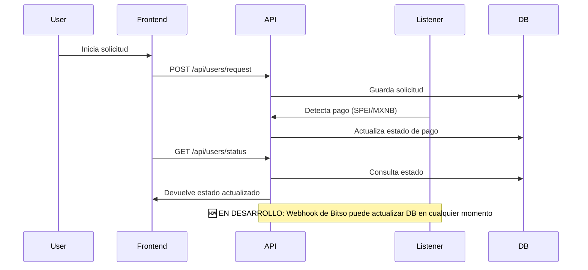

# 🛠️ README Iteración 12-07-25: Onboarding Identidad Digital

## 🎯 Objetivo
Desarrollar un sistema donde el usuario pueda realizar un pago (SPEI o MXNB), obtener una identidad digital (DID en KILT) y recibir una credencial verificable, todo de forma automatizada y transparente.

---

## 🚀 Novedades de esta iteración

- **Integración de ngrok con dominio estático** para exponer el backend local y permitir pruebas reales de webhooks y autenticación con Sporran/KILT.
- **Flujo de onboarding manual**: El usuario paga (SPEI/MXNB), se captura su dirección KILT, se registra el pago en la base de datos.
- **Configuración base para webhooks**: El backend está preparado para exponer un endpoint público para recibir notificaciones de Bitso sobre pagos recibidos.
- **Mejoras de CORS y .well-known**: Ajuste de variables de entorno y archivos para soportar dominios públicos y pruebas con wallets.
- **📋 EN DESARROLLO**: Integración completa de webhooks de Bitso y onboarding automatizado.

---

## ⚙️ Variables de Entorno Iniciales

```env
# Portal MPC API Configuration
NEXT_PUBLIC_PORTAL_CLIENT_API_KEY=
NEXT_PUBLIC_PORTAL_CLIENT_ID=

# Portal API Endpoints
NEXT_PUBLIC_PORTAL_MPC_API_URL=
NEXT_PUBLIC_PORTAL_MPC_API_KEY=
NEXT_PUBLIC_PORTAL_API_URL=

# Environment
NEXT_PUBLIC_PORTAL_ENVIRONMENT=

# RPC URLs for Portal
NEXT_PUBLIC_PORTAL_RPC_SEPOLIA=
NEXT_PUBLIC_PORTAL_RPC_ARBITRUM=
NEXT_PUBLIC_PORTAL_RPC_SOLANA_DEVNET=

# Juno API
NEXT_PUBLIC_JUNO_API_URL=
JUNO_API_KEY=
JUNO_SECRET_KEY=

# Backend Dapp
SUBMITTER_MNEMONIC_DAPP=
ASSERTION_METHOD_DAPP_KEY=

# ngrok dominio estático para pruebas
BASE_URL=https://grizzly-precious-largely.ngrok-free.app
CORS_ORIGIN=https://grizzly-precious-largely.ngrok-free.app
DAPP_DOMAIN=https://grizzly-precious-largely.ngrok-free.app
```

---

## 📝 Hoja Técnica del Proyecto

### Nombre del Proyecto
Onboarding Identidad Digital y Credencial Verificable

### Descripción
Sistema que permite a un usuario obtener una identidad digital y una credencial verificable tras realizar un pago SPEI o MXNB, integrando conversión de fondos a MXNB y emisión de DIDs y credenciales en KILT.

### Flujo Principal (Estado Actual)
1. El usuario accede al sistema y solicita su identidad digital.
2. Realiza un pago SPEI o transfiere MXNB a la cuenta indicada.
3. **MANUAL**: El sistema detecta el pago usando listeners (Juno para SPEI, smart contract para MXNB).
4. El monto en MXN se convierte a MXNB en Arbitrum (si aplica).
5. Se genera un FullDID en KILT.
6. El usuario recibe una credencial verificable asociada a su identidad.

### Flujo Futuro (Con One-Time Payment API)

#### **Flujo Completo con One-Time Payment**
1. **Usuario accede al sistema** → Detectamos Sporran
2. **Si no tiene FullDID** → Modal de pago se abre automáticamente
3. **Capturamos KILT address** → Usuario selecciona cuenta donde recibirá KILT
4. **Creamos One-Time Payment** → Con payment_id único basado en KILT address
5. **Usuario paga** → Usando CLABE y payment_id proporcionados
6. **Webhook recibe confirmación** → Consultamos estado del pago
7. **Si pago completado** → Enviamos 3 KILT a la dirección capturada
8. **Usuario revisa dashboard** → `/status/{kiltAddress}` para ver balance
9. **Usuario reclama FullDID** → Botón aparece cuando tiene balance
10. **Se genera FullDID** → Usuario recibe credencial verificable

#### **Dashboard de Estatus Personal**
- **URL**: `/status/{kiltAddress}` (pública, sin login)
- **Acceso**: Solo con la dirección KILT registrada
- **Información**:
  - Balance de KILT en la dirección
  - Estado del pago (pendiente/completado/expired)
  - Payment ID de Bitso
  - Fecha de expiración del pago
  - Botón "Reclamar FullDID" (si tiene balance)
  - Historial de transacciones

---

## 🧩 Tipos TypeScript

```typescript
export interface User {
  id: string;
  kiltAddress: string;     // Identificador único del usuario
  name?: string;           // Opcional
  createdAt: Date;
  updatedAt: Date;
}

export interface IdentityRequest {
  id: string;
  kiltAddress: string;         // Identificador único del usuario
  paymentType: 'SPEI' | 'MXNB';
  bitsoPaymentId: string;      // ID único del pago en Bitso (KILT-4abc1234-1703123456789)
  paymentStatus: 'pending' | 'paid' | 'failed' | 'expired';
  didCreated: boolean;
  credentialIssued: boolean;
  kiltBalance?: number;         // Balance de KILT en la dirección
  expirationDate?: Date;        // Fecha de expiración del pago
  clabe?: string;              // CLABE que recibe el pago
  beneficiary?: string;         // Organización que recibe el pago
  requestedAt: Date;
  updatedAt: Date;
}

export interface PaymentEvent {
  id: string;
  type: 'SPEI' | 'MXNB';
  amount: number;
  currency: 'MXN' | 'MXNB';
  userId: string;
  paymentReference: string;
  status: 'confirmed' | 'rejected';
  detectedAt: Date;
}

export interface PaymentListener {
  listenToSpeiPayments(accountNumber: string): Promise<PaymentEvent[]>;
  listenToMxnbPayments(walletAddress: string): Promise<PaymentEvent[]>;
  associatePaymentWithUser(payment: PaymentEvent, userId: string): Promise<void>;
}

export interface DidCreation {
  createFullDid(userWallet: string): Promise<string>;
  generateVerifiableCredential(did: string, ineData: IneData): Promise<Credential>;
}

export interface IneData {
  nombre: string;
  curp: string;
  claveElector: string;
}

export interface Credential {
  id: string;
  did: string;
  issuedAt: Date;
  data: IneData;
  issuer: string;
}

export interface OnboardingStatus {
  requestId: string;
  paymentStatus: 'pending' | 'paid' | 'processing' | 'completed' | 'failed';
  didStatus: 'not_created' | 'created';
  credentialStatus: 'not_issued' | 'issued';
  lastUpdate: Date;
}

// 🆕 TIPOS PARA ONE-TIME PAYMENT API
export interface BitsoOneTimePayment {
  payment_id: string;        // ID único del pago (KILT-4abc1234-1703123456789)
  amount: string;            // Cantidad esperada
  payer_name: string;        // Nombre del pagador esperado
  expiration_date: string;   // Fecha límite para el pago
  clabe: string;            // CLABE que recibe el pago
  beneficiary: string;       // Organización que recibe el pago
  status: 'PENDING' | 'COMPLETED' | 'EXPIRED';
  created_at: string;       // Fecha de creación
  updated_at?: string;      // Fecha de última actualización
}

export interface BitsoPaymentDetails {
  payment_id: string;
  amount: string;
  expiration_date: string;
  clabe: string;
  beneficiary: string;
  status: 'PENDING' | 'COMPLETED' | 'EXPIRED';
  details?: {
    rejection?: {
      created_at: string;
      updated_at?: string;
    };
  };
}

export interface WebhookEventRecord {
  id: string;
  event_type: 'payment_completed' | 'payment_expired' | 'payment_rejected';
  event_id: string; // payment_id de Bitso
  payload: any; // JSON completo del payload
  received_at: Date;
  processed: boolean;
  processed_at?: Date;
  error_message?: string;
  ip_address: string;
  user_agent?: string;
}

export interface WebhookEventRecord {
  id: string;
  event_type: 'funding' | 'withdrawal' | 'dynamic_qr_code';
  event_id: string; // fid o wid
  payload: any; // JSON completo del payload
  received_at: Date;
  processed: boolean;
  processed_at?: Date;
  error_message?: string;
  ip_address: string;
  user_agent?: string;
}
```

---

## 🏗️ Estructura Recomendada del Proyecto

```
/src
  /config
  /services
    /listeners
    /payments
    /did
    /notifications
    /crm
    /webhooks         # <--- Nuevo: lógica y controladores para webhooks
  /onboarding
  /components
  /types
  /utils
  /admin
  /scripts
```

---

## 🔗 Relaciones y Flujo

1. Usuario inicia solicitud → Formulario de pago
2. Listener detecta pago (SPEI/MXNB) o webhook de Bitso
3. Backend asocia pago y usuario, verifica unicidad
4. Script/envío automático de 3 KILT al usuario
5. Frontend habilita botón "Obtener Identidad Digital"
6. Usuario firma tx con Sporran
7. Backend crea FullDID y emite credencial
8. Usuario recibe credencial verificable
9. CRM/Admin puede ver y gestionar solicitudes
10. **🆕 EN DESARROLLO**: Webhook de Bitso actualiza estado de pago y dispara procesos automáticos

---

## 🛡️ Notas de Seguridad y Control
- Unicidad de solicitud por usuario (KILT/Substrate)
- Sesión de usuario con UUID
- Panel de administración protegido por DID admin
- Variables de entorno para claves de backend
- **🆕 Webhooks (EN DESARROLLO):**
  - Procesar eventos de Bitso de forma idempotente (no duplicar pagos)
  - Validar origen/IP del webhook en producción
  - Responder rápido (200 OK) y procesar asíncrono

---

## 🖥️ Frontend
- Radix UI y Tailwind v4
- Mobile responsive
- Polkadot Extension Dapp para Sporran
- Flujo guiado y seguro
- **Integración con dominio ngrok para pruebas reales**

---

## 🗄️ Backend
- Express y PostgreSQL
- Scripts automatizados para actualización de estados y envío de KILT
- **🆕 EN DESARROLLO**: Endpoint público para webhooks de Bitso
- **🆕 EN DESARROLLO**: Persistencia de eventos de webhook
- **🆕 EN DESARROLLO**: Dashboard de estatus personal

## 🖥️ Panel de Administración (CMS)
- **Dashboard de eventos de webhook**: Ver todos los eventos recibidos de Bitso
- **Estado de pagos**: Monitorear pagos pendientes, completados y fallidos
- **Auditoría de transacciones**: Historial completo de todas las operaciones
- **Gestión de solicitudes**: Ver y gestionar solicitudes de identidad digital

## 📊 Dashboard de Estatus Personal
- **URL pública**: `/status/{kiltAddress}` (sin login)
- **Acceso**: Solo con dirección KILT registrada
- **Funcionalidades**:
  - Ver balance de KILT
  - Estado del pago
  - Botón "Reclamar FullDID" (si tiene balance)
  - Historial de transacciones

---

## 💡 Recomendaciones
- Listeners para SPEI y MXNB
- Automatización de procesos
- Documentar y versionar cada iteración
- **🆕 EN DESARROLLO**: Persistir eventos de webhook en tabla `webhook_events`

---

## 🛰️ Organización de Listeners, APIs, Scripts, Base de Datos y Frontend

### ¿Los listeners pertenecen a una API?

Sí, los **listeners** forman parte del backend (API). Se encargan de escuchar eventos externos (pagos SPEI vía Juno, transferencias MXNB en blockchain, webhooks de Bitso), procesar esos eventos y actualizar la base de datos. Además, pueden exponer endpoints para que el frontend consulte el estado de los pagos o el onboarding.

**Ejemplo:**
Un listener de pagos SPEI puede ser un servicio que corre en segundo plano o como parte de la API, y cuando detecta un pago, actualiza la tabla de solicitudes en la base de datos.

### 🗂️ Organización de APIs y Scripts por Servicios

#### Estructura Sugerida

```
/src
  /api
    /listeners         # Endpoints y lógica para escuchar pagos (SPEI, MXNB)
    /users             # Endpoints para gestión de usuarios y solicitudes
    /did               # Endpoints para creación de DIDs y credenciales
    /admin             # Endpoints protegidos para CRM/admin
    /webhooks          # <--- Nuevo: endpoints y lógica para webhooks
  /services
    /juno              # Lógica para interactuar con Juno (pagos SPEI)
    /mxnb              # Lógica para interactuar con contratos MXNB
    /kilt              # Lógica para DIDs y credenciales
    /notifications     # Lógica para alertas y notificaciones
    /webhooks          # <--- Nuevo: lógica para procesar eventos de webhook
  /scripts
    /juno              # Scripts automatizados para pagos SPEI
    /mxnb              # Scripts para pagos MXNB
    /kilt              # Scripts para emisión de DIDs y credenciales
    /admin             # Scripts para tareas administrativas
```

- **/api/**: Controladores y rutas de la API REST, organizados por dominio/servicio.
- **/services/**: Lógica de negocio e integración con servicios externos.
- **/scripts/**: Automatizan tareas, organizados por servicio.
- **Base de datos**: Tablas y relaciones por dominio.
- **Frontend**: Consume la API, organizado por vistas/funcionalidad.

### 🗄️ Base de Datos

- **Tablas organizadas por dominio:** Ejemplo: `users`, `identity_requests`, `payments`, `credentials`, `webhook_events` (🆕 EN DESARROLLO).
- **Relaciones claras:** Cada tabla tiene claves foráneas para mantener la integridad (por ejemplo, `identity_requests` tiene `user_id`).

### 🖥️ Frontend

- **Consume la API**: El frontend solo interactúa con la API, nunca directamente con la base de datos.
- **Organización por vistas/funcionalidad:** Ejemplo:
  - `/onboarding` (flujo de usuario)
  - `/admin` (CRM protegido)
  - `/status` (seguimiento de solicitudes)

### 🔄 Flujo de Comunicación



### ✅ Resumen de Organización

- **Listeners**: Parte del backend/API, pueden ser servicios o scripts que actualizan la base de datos.
- **APIs**: Organizadas por dominio/servicio, exponen endpoints REST.
- **Scripts**: Automatizan tareas, organizados por servicio.
- **Base de datos**: Tablas y relaciones por dominio.
- **Frontend**: Consume la API, organizado por vistas/funcionalidad.

---

## 🌐 Webhooks y Bitso

### 🔍 PROBLEMA: Identificación de Usuarios en Webhooks

**El desafío principal es: ¿Cómo identificar qué usuario realizó el pago cuando recibimos el webhook de Bitso?**

#### Solución Implementada: One-Time Payment API

**✅ One-Time Payment API de Bitso**
- **Endpoint**: `POST https://api-stage.bitso.com/spei/v1/payments`
- **Identificación**: `payment_id` único basado en KILT address
- **Ventaja**: Identificación automática y rastreable
- **Estado**: ✅ Implementación definida

**Flujo de Identificación:**
1. **Generar payment_id**: `KILT-${kiltAddress.substring(0, 8)}-${Date.now()}`
2. **Crear one-time payment**: Con payment_id único
3. **Usuario paga**: Usando CLABE y payment_id
4. **Webhook recibe**: payment_id en el payload
5. **Sistema identifica**: Busca por payment_id en base de datos

#### 🆕 IMPLEMENTACIÓN: Flujo con One-Time Payment

```typescript
// 1. Usuario captura KILT address
const kiltAddress = "4abc123...";

// 2. Generar payment_id único
const paymentId = `KILT-${kiltAddress.substring(0, 8)}-${Date.now()}`;
// Ejemplo: "KILT-4abc1234-1703123456789"

// 3. Crear one-time payment
const oneTimePayment = await bitsoService.createOneTimePayment({
  payment_id: paymentId,
  amount: '150.00',
  payer_name: 'Usuario KILT'
});

// Respuesta de Bitso:
{
  success: true,
  payload: {
    payment_id: "KILT-4abc1234-1703123456789",
    amount: "150.00",
    payer_name: "Usuario KILT",
    expiration_date: "2024-01-16T10:30:00Z",
    clabe: "012180001234567890",
    beneficiary: "Peranto Ci.Go",
    status: "PENDING"
  }
}

// 4. Guardar en base de datos
await createIdentityRequest({
  kiltAddress,
  bitsoPaymentId: paymentId,
  paymentStatus: 'pending',
  expirationDate: new Date(oneTimePayment.payload.expiration_date),
  clabe: oneTimePayment.payload.clabe,
  beneficiary: oneTimePayment.payload.beneficiary
});

// 5. Usuario paga usando CLABE y payment_id
// 6. Webhook recibe confirmación
// 7. Sistema consulta estado del pago
const paymentDetails = await bitsoService.getPaymentDetails(paymentId);

// 8. Si pago completado, enviar KILT
if (paymentDetails.payload.status === "COMPLETED") {
  await sendKiltToUser(kiltAddress, 3);
  await updateIdentityRequest(identityRequest.id, {
    paymentStatus: 'paid',
    kiltBalance: 3
  });
}
```

```typescript
// 1. Usuario solicita identidad
const identityRequest = await createIdentityRequest(userId, {
  amount: 150.00,
  currency: 'MXN'
});

// 2. Generar dirección única para el usuario
const destinationAddress = await bitsoService.createDestinationAddress({
  currency: 'mxn',
  network: 'arbitrum', // Para MXNB
  label: `Usuario-${userId}`,
  callback_url: `${BASE_URL}/api/webhooks/bitso-webhook`
});

// 3. Guardar la dirección única
await updateIdentityRequest(identityRequest.id, {
  destinationAddress: destinationAddress.address,
  destinationId: destinationAddress.id
});

// 4. Usuario paga a su dirección única
// El webhook incluirá la dirección de destino

// 5. Webhook procesa evento
async function processFundingEvent(payload: BitsoFundingPayload) {
  // Buscar por dirección de destino
  const identityRequest = await findIdentityRequestByDestinationAddress(
    payload.details.receiving_address
  );
  
  if (identityRequest && payload.status === 'complete') {
    await updatePaymentStatus(identityRequest.id, 'paid');
    await triggerOnboardingProcess(identityRequest.id);
  }
}
```

### 🆕 IMPLEMENTACIÓN TÉCNICA RECOMENDADA

#### 1. **Extender el Schema de Prisma**

```prisma
// Actualizar IdentityRequest
model IdentityRequest {
  id                String   @id @default(uuid())
  kiltAddress       String   // Identificador único del usuario
  paymentType       PaymentType
  bitsoPaymentId    String   @unique // ID único del pago en Bitso
  paymentStatus     PaymentStatus @default(PENDING)
  didCreated        Boolean  @default(false)
  credentialIssued  Boolean  @default(false)
  kiltBalance       Decimal? @db.Decimal(10, 2)
  expirationDate    DateTime? // Fecha de expiración del pago
  clabe             String?  // CLABE que recibe el pago
  beneficiary       String?  // Organización que recibe el pago
  requestedAt       DateTime @default(now())
  updatedAt         DateTime @updatedAt
  
  @@index([kiltAddress])
  @@index([bitsoPaymentId])
  @@index([paymentStatus])
}

// Nueva tabla para webhook_events
model WebhookEvent {
  id            String   @id @default(uuid())
  eventType     String   // 'payment_completed', 'payment_expired', 'payment_rejected'
  eventId       String   @unique // payment_id de Bitso
  payload       Json     // Payload completo del evento
  receivedAt    DateTime @default(now())
  processed     Boolean  @default(false)
  processedAt   DateTime?
  errorMessage  String?
  ipAddress     String
  userAgent     String?
  
  @@index([eventType])
  @@index([processed])
  @@index([receivedAt])
}

// Enums
enum PaymentType {
  SPEI
  MXNB
}

enum PaymentStatus {
  PENDING
  PAID
  FAILED
  EXPIRED
}
```

#### 2. **Dashboard de Estatus Personal**

```typescript
// Endpoint para dashboard de estatus
app.get('/status/:kiltAddress', async (req, res) => {
  const { kiltAddress } = req.params;
  
  // Buscar solicitud por dirección KILT
  const identityRequest = await findIdentityRequestByKiltAddress(kiltAddress);
  
  if (!identityRequest) {
    return res.status(404).json({ error: 'Solicitud no encontrada' });
  }
  
  // Obtener balance actual de KILT
  const kiltBalance = await getKiltBalance(kiltAddress);
  
  return res.json({
    kiltAddress,
    bitsoPaymentId: identityRequest.bitsoPaymentId,
    paymentStatus: identityRequest.paymentStatus,
    kiltBalance,
    canClaimDid: kiltBalance >= 3 && !identityRequest.didCreated,
    didCreated: identityRequest.didCreated,
    credentialIssued: identityRequest.credentialIssued,
    expirationDate: identityRequest.expirationDate,
    clabe: identityRequest.clabe,
    beneficiary: identityRequest.beneficiary,
    requestedAt: identityRequest.requestedAt
  });
});

// Endpoint para reclamar FullDID
app.post('/claim-did/:kiltAddress', async (req, res) => {
  const { kiltAddress } = req.params;
  
  const identityRequest = await findIdentityRequestByKiltAddress(kiltAddress);
  const kiltBalance = await getKiltBalance(kiltAddress);
  
  if (kiltBalance < 3) {
    return res.status(400).json({ error: 'Balance insuficiente' });
  }
  
  if (identityRequest.didCreated) {
    return res.status(400).json({ error: 'FullDID ya creado' });
  }
  
  // Crear FullDID
  const did = await createFullDid(kiltAddress);
  
  // Actualizar estado
  await updateIdentityRequest(identityRequest.id, {
    didCreated: true,
    did: did
  });
  
  return res.json({ success: true, did });
});
```

#### 3. **Extender BitsoService**

```typescript
// Agregar a BitsoService
async createOneTimePayment(params: {
  payment_id: string;
  amount: string;
  payer_name: string;
}): Promise<BitsoOneTimePayment> {
  const response = await fetch('https://api-stage.bitso.com/spei/v1/payments', {
    method: 'POST',
    headers: {
      accept: 'application/json',
      'content-type': 'application/json'
    },
    body: JSON.stringify(params)
  });
  
  return response.json();
}

async getPaymentDetails(paymentId: string): Promise<BitsoPaymentDetails> {
  const response = await fetch(`https://api-stage.bitso.com/spei/v1/payments/${paymentId}`, {
    method: 'GET',
    headers: {
      accept: 'application/json'
    }
  });
  
  return response.json();
}

generatePaymentId(kiltAddress: string): string {
  return `KILT-${kiltAddress.substring(0, 8)}-${Date.now()}`;
}
```

### 🆕 PROPUESTA: Tabla webhook_events

```sql
-- Tabla para persistir eventos de webhook de Bitso
CREATE TABLE webhook_events (
  id UUID PRIMARY KEY DEFAULT gen_random_uuid(),
  event_type VARCHAR(50) NOT NULL, -- 'funding', 'withdrawal', 'dynamic_qr_code'
  event_id VARCHAR(255) NOT NULL, -- fid o wid de Bitso
  payload JSONB NOT NULL, -- Payload completo del evento
  received_at TIMESTAMP WITH TIME ZONE DEFAULT NOW(),
  processed BOOLEAN DEFAULT FALSE,
  processed_at TIMESTAMP WITH TIME ZONE,
  error_message TEXT,
  ip_address INET NOT NULL, -- Para validación de seguridad
  user_agent TEXT,
  
  -- Índices para optimizar consultas
  CONSTRAINT unique_event_id UNIQUE(event_id),
  INDEX idx_webhook_events_type (event_type),
  INDEX idx_webhook_events_processed (processed),
  INDEX idx_webhook_events_received_at (received_at)
);
```

### 🆕 PROPUESTA: Estructura básica del endpoint de webhook

```typescript
// /src/api/webhooks/bitso-webhook.ts
import { Request, Response } from 'express';
import { BitsoWebhookEvent, WebhookEventRecord } from '../types/webhooks';

// IPs permitidas de Bitso (según documentación)
const ALLOWED_IPS = {
  sandbox: ['3.142.85.93', '3.18.37.180', '18.188.192.89'],
  stage: ['3.129.233.228', '3.22.247.241', '3.134.133.168'],
  production: ['52.15.91.227', '18.216.72.107', '18.219.140.132']
};

export async function handleBitsoWebhook(req: Request, res: Response) {
  try {
    // 1. Validar IP de origen (seguridad)
    const clientIP = req.ip || req.connection.remoteAddress;
    if (!isAllowedIP(clientIP)) {
      console.warn(`Webhook rechazado desde IP no permitida: ${clientIP}`);
      return res.status(403).json({ error: 'IP no autorizada' });
    }

    // 2. Validar estructura del payload
    const webhookEvent: BitsoWebhookEvent = req.body;
    if (!isValidWebhookEvent(webhookEvent)) {
      console.error('Payload de webhook inválido:', req.body);
      return res.status(400).json({ error: 'Payload inválido' });
    }

    // 3. Responder inmediatamente (evitar timeout)
    res.status(200).json({ success: true });

    // 4. Procesar evento de forma asíncrona
    await processWebhookEventAsync(webhookEvent, clientIP, req.headers['user-agent']);

  } catch (error) {
    console.error('Error procesando webhook:', error);
    // Ya respondimos 200, solo log del error
  }
}

async function processWebhookEventAsync(
  event: BitsoWebhookEvent, 
  ipAddress: string, 
  userAgent?: string
) {
  try {
    // 1. Guardar evento en base de datos
    const eventRecord: WebhookEventRecord = {
      id: generateUUID(),
      event_type: event.event,
      event_id: getEventId(event), // fid o wid
      payload: event.payload,
      received_at: new Date(),
      processed: false,
      ip_address: ipAddress,
      user_agent: userAgent
    };

    await saveWebhookEvent(eventRecord);

    // 2. Verificar si ya procesamos este evento (idempotencia)
    const existingEvent = await findWebhookEventByEventId(eventRecord.event_id);
    if (existingEvent?.processed) {
      console.log(`Evento ${eventRecord.event_id} ya procesado, saltando`);
      return;
    }

    // 3. Procesar según tipo de evento
    switch (event.event) {
      case 'funding':
        await processFundingEvent(event.payload);
        break;
      case 'withdrawal':
        await processWithdrawalEvent(event.payload);
        break;
      case 'dynamic_qr_code':
        await processDynamicQREvent(event.payload);
        break;
    }

    // 4. Marcar como procesado
    await markWebhookEventAsProcessed(eventRecord.id);

  } catch (error) {
    console.error('Error procesando evento de webhook:', error);
    await markWebhookEventAsError(eventRecord.id, error.message);
  }
}

async function processFundingEvent(payload: BitsoFundingPayload) {
  // Lógica específica para eventos de funding
  if (payload.status === 'complete') {
    // Buscar solicitud de identidad asociada a este pago
    const identityRequest = await findIdentityRequestByPayment(payload.fid);
    if (identityRequest) {
      // Actualizar estado del pago
      await updatePaymentStatus(identityRequest.id, 'paid');
      // Disparar proceso de onboarding automático
      await triggerOnboardingProcess(identityRequest.id);
    }
  }
}

// Funciones auxiliares
function isAllowedIP(ip: string): boolean {
  const environment = process.env.NODE_ENV || 'development';
  const allowedIPs = ALLOWED_IPS[environment] || ALLOWED_IPS.sandbox;
  return allowedIPs.includes(ip);
}

function isValidWebhookEvent(event: any): event is BitsoWebhookEvent {
  return event && 
         event.event && 
         event.payload && 
         ['funding', 'withdrawal', 'dynamic_qr_code'].includes(event.event);
}

function getEventId(event: BitsoWebhookEvent): string {
  return event.payload.fid || event.payload.wid;
}
```

### ¿Cómo funciona la integración?

1. El backend expone un endpoint público `/api/payments/bitso-webhook`.
2. Se registra la URL en Bitso (dashboard o API).
3. Cuando Bitso detecta un pago, envía un POST con el evento (funding, withdrawal, etc).
4. El backend procesa el evento, actualiza el estado del pago y dispara la entrega de KILT si corresponde.
5. **🆕 EN DESARROLLO**: El evento se guarda en la tabla `webhook_events` para auditoría y evitar duplicados.

### Checklist para la creación y registro del webhook

- [x] Exponer endpoint público en backend
- [x] Configurar ngrok con dominio estático
- [x] Actualizar variables de entorno y .well-known
- [ ] 🆕 Implementar tabla `webhook_events`
- [ ] 🆕 Implementar lógica de procesamiento de webhooks
- [ ] 🆕 Registrar el webhook en Bitso
- [ ] 🆕 Procesar eventos de forma idempotente y segura
- [ ] 🆕 Guardar eventos en tabla `webhook_events`

### ¿Es necesario guardar los eventos de webhook en una tabla?

**Recomendado pero no obligatorio.**
- Guardar cada evento recibido (con su `fid`/`wid`, tipo, payload, fecha, procesado) ayuda a:
  - Auditar y debuggear pagos
  - Evitar procesar el mismo evento dos veces
  - Tener trazabilidad completa de los pagos y retiros
- Si tu volumen es bajo y confías en la lógica de idempotencia, puedes omitirlo, pero para producción y auditoría es una buena práctica.

---

## 💡 Próximos pasos
- [ ] 🆕 Extender el schema de Prisma con `bitsoPaymentId`, `WebhookEvent` y enums actualizados
- [ ] 🆕 Implementar `createOneTimePayment` y `getPaymentDetails` en BitsoService
- [ ] 🆕 Implementar dashboard de estatus personal (`/status/{kiltAddress}`)
- [ ] 🆕 Modificar el flujo para capturar KILT address y generar payment_id
- [ ] 🆕 Implementar el endpoint `/api/webhooks/bitso-webhook`
- [ ] 🆕 Implementar la lógica de procesamiento de eventos de pago
- [ ] 🆕 Registrar el webhook en Bitso
- [ ] 🆕 Crear panel de administración (CMS) para superadministrador
- [ ] 🆕 Probar el flujo completo con pagos reales y webhooks
- [ ] 🆕 Documentar cada iteración y cambios en el flujo 